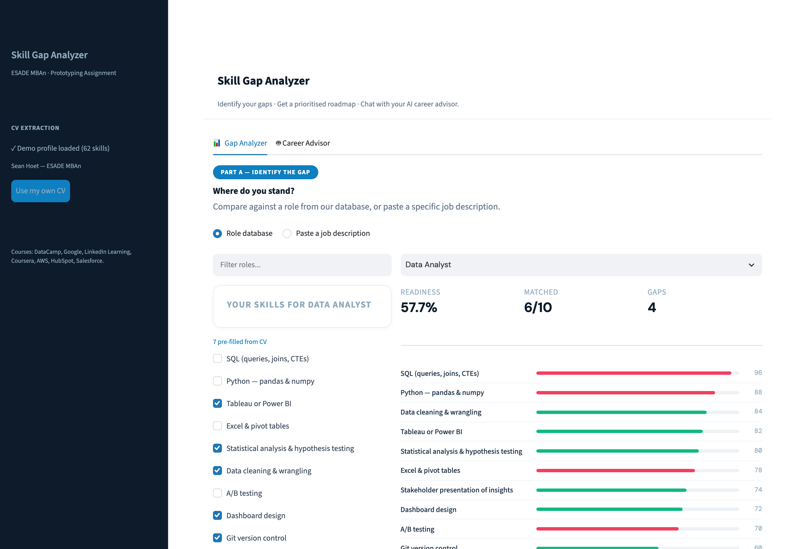

# 🎯 Career Bridge

### Live demo: [skillgapanalyzer-miba.streamlit.app](https://skillgapanalyzer-miba.streamlit.app/)

> Hosted on Streamlit's free tier, so the app sleeps after a period of inactivity. If you land on a "Zzzz" screen, click **"Yes, get this app back up!"** — it wakes in about 30 seconds.



A Streamlit prototype that shows exactly which skills you're missing for your target job role — ranked by importance, with optional AI-powered CV parsing and an LLM career advisor that runs real Python analysis under the hood.

Built for the PDAI Prototyping Assignment.

---

## What It Does

- Select a target job role from 14 curated profiles (Data Analyst, ML Engineer, Product Manager, etc.) — or paste a raw job description
- Check off the skills you already have — or upload your CV as a `.txt` file and let AI extract them automatically
- See a visual bar chart of all required skills, color-coded green (have) vs red (missing)
- Get a readiness score **weighted by skill importance**, so missing one critical skill costs more than missing three peripheral ones
- View a personalized learning roadmap, prioritised by ROI (importance per hour of study), with course links

## The Career Advisor agent

The second tab is a chat agent built on Gemini's Automatic Function Calling. Rather than letting the model reason about numbers in prose, it exposes six Python tools that do the actual computation and feed structured results back:

| Tool | What it computes |
|---|---|
| `find_closest_roles` | Scores all 14 roles against your skills, ranked |
| `get_role_requirements` | Full skill list for a role with importance + learning hours |
| `compute_gap_analysis` | Readiness score, matched/missing skills, ROI ordering |
| `compare_roles` | Two roles side by side, shared vs unique skills, pivot cost |
| `estimate_transition_time` | Learning hours converted to a realistic timeline |
| `get_skill_radar_data` | Category-level breakdown for the radar chart |

The model decides *which* tools to call and *when*; the scoring itself is deterministic Python, so the numbers it quotes are reproducible rather than hallucinated.

---

## Setup Instructions

### 1. Clone the repository
```bash
git clone https://github.com/seanhoet65/career-bridge.git
cd career-bridge
```

### 2. Create a virtual environment (recommended)
```bash
python -m venv venv
source venv/bin/activate        # Mac/Linux
venv\Scripts\activate           # Windows
```

### 3. Install dependencies
```bash
pip install -r requirements.txt
```

### 4. Add your Gemini API key (for CV parsing and the Career Advisor)

The app reads the key from Streamlit secrets, not an environment variable. Create `.streamlit/secrets.toml`:

```toml
GEMINI_API_KEY = "your-key-here"
```

Get a free key at [aistudio.google.com/apikey](https://aistudio.google.com/apikey). The file is gitignored — never commit it.

Without a key the app still runs: the gap analysis, scoring, charts, and roadmap all work from the built-in demo profile. Only the AI-powered CV extraction and the Career Advisor chat need the key.

### 5. Run the app
```bash
streamlit run app.py
```

The app will open at `http://localhost:8501`

### Running the tests

```bash
pip install pytest
python -m pytest tests/ -q
```

21 tests cover the scoring engine — importance weighting, ROI ordering, role matching, and the division-by-zero and substring-matching edge cases. No API key or network needed.

---

## How to Use the CV Upload Feature

1. Save your CV as a plain `.txt` file (copy-paste from Word or PDF into a text file)
2. Upload it in the sidebar
3. Click "Extract Skills with AI"
4. Gemini reads your CV, normalises what it finds to the app's canonical skill names, and ticks the matching boxes

---

## Streamlit Widgets Used

- `st.tabs` — organizes the app into Gap Analysis, Learning Roadmap, and About sections
- `st.metric` — displays readiness score and skill counts as bold summary cards
- `st.progress` — shows overall readiness as a visual progress bar
- `st.expander` — each missing skill expands to show priority level and course link
- `st.file_uploader` — CV upload
- `st.checkbox` — skill selection
- `st.plotly_chart` — horizontal bar chart with color-coded skills

---

## Data Source

The 14 role profiles the app ships with are **hand-curated** (`roles_data.py`), each skill carrying an importance weight and an estimated learning-hours cost. They were written by hand rather than pulled from a database because O*NET's generic descriptors ("Programming", "Critical Thinking") are too coarse to give a job-seeker anything actionable — "SQL (queries, joins, CTEs)" is a skill you can go and learn on Tuesday.

An O*NET loader (`data_loader.py` + `setup_data.py`) is also included and can pull real importance ratings from the **O*NET database** (U.S. Department of Labor) for any of ~900 occupations. It is not wired into the main app — it exists as the more general, less specific alternative path.

---

## Roadmap (Future Features)

- Resume PDF parsing (not just .txt)
- Salary data per skill from Glassdoor/Levels.fyi
- Skill acquisition tracker over time
- More job roles
- Export gap report as PDF
